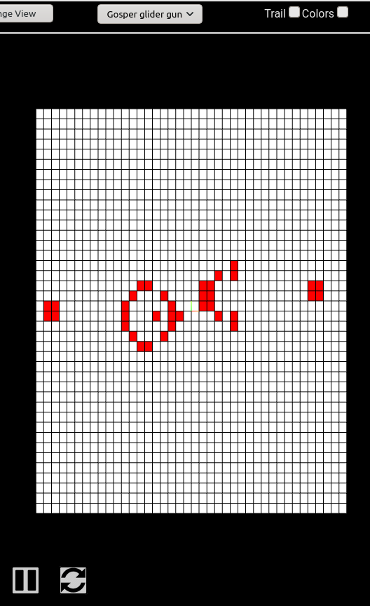
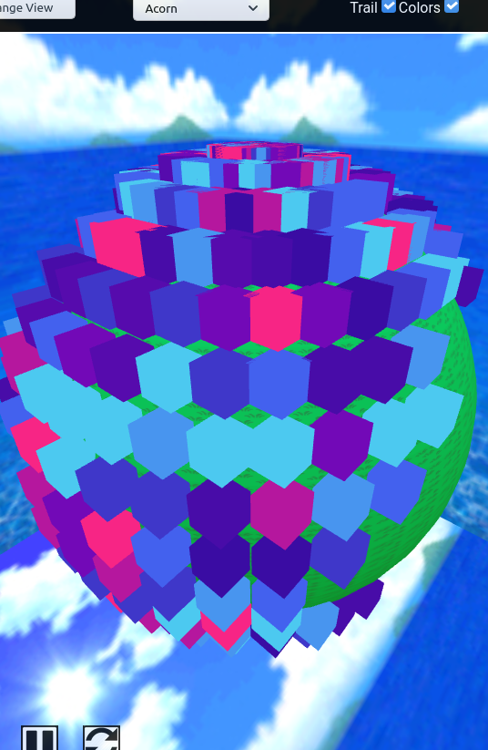

# Game of Life three.js web app


A React.js web app to interact with a WebGL(three.js) implementation of Conway's Game of Life.

# Table of contents

- [Live Version](#liveversion)
- [Screenshots](#screenshots)
- [Installation](#installation)
- [Development](#development)
  - [Codebase](#codebase)
    - [Technologies](#technologies)
    - [Folder Structure](#folder-structure)
  - [Design Overview](#design-overview)
- [License](#license)

# Live Version
[(Back to top)](#table-of-contents)


[Go to live version.](#)

# Screenshots
[(Back to top)](#table-of-contents)

### In progress screenshots
As of 03/29/21:



# Installation
[(Back to top)](#table-of-contents)

Clone this repository, navigate into the project folder, and build the dependencies by executing:

```sh
git clone https://github.com/feydor/game-of-life.git
cd game-of-life
npm install
```

After installing the dependencies, start the development server by executing:

```sh
npm start
```

By default a development server will start at ``http://localhost:3000``. 

# Development
[(Back to top)](#table-of-contents)

## Codebase

### Technologies

Technologies used in this mono repo include:

- React.Js: front-end framework
- Three.js: WebGL library
- HTML5 Canvas: animation and browser rendering api
- create-react-app: Web application bundler and setup
- Prettier: JS code style formatter
- Jest: Testing framework

### Folder Structure

```sh
game-of-life/
├── examples   # Screenshots and assorted images
├── public     # textures, models, resources
└── src        # Front end React.js app
    ├── components           # React.js components, including HTML5 Canvas
    ├── containers           # React.js top-level container
    └── game                 # Conway's Game of Life programatic implementation in TypeScript

```

## Design Overview
[(Back to top)](#table-of-contents)

## Psuedocode

### Conway's Game of Life
The following is the main algorithm for calculating the next game state:
<pre><code>
<b>algorithm</b> GoL is
    <b>input:</b> an array <em>CellMap</em> filled with the initial start condition (ISC),
    <em>(Note: The ISC can be thought of as a program in GoL, written in simple binary, in which GoL is the processor.)</em>
    <b>output:</b> the same returned with the next iteration of GoL

    <b>foreach</b> cell, <em>C</em> in <em>CellMap</em>
        <b>let</b> the number of <em>C</em>'s neighbors be <em>ncount</em>
        <b>let</b> the current cell state of <em>C</em> be <em>cstate</em>

        <b>if</b> <em>cstate</em> is 1 and <em>ncount</em> less than 2 or greater than 3
            <em>C</em> = 0
        <b>else if</b> <em>ncount</em> is equal to 3
            <em>C</em> = 1
   
   <b>return</b> <em>CellMap</em>
</pre></code>

# License
[(Back to top)](#table-of-contents)

MIT, see the [LICENSE](./LICENSE) file.
